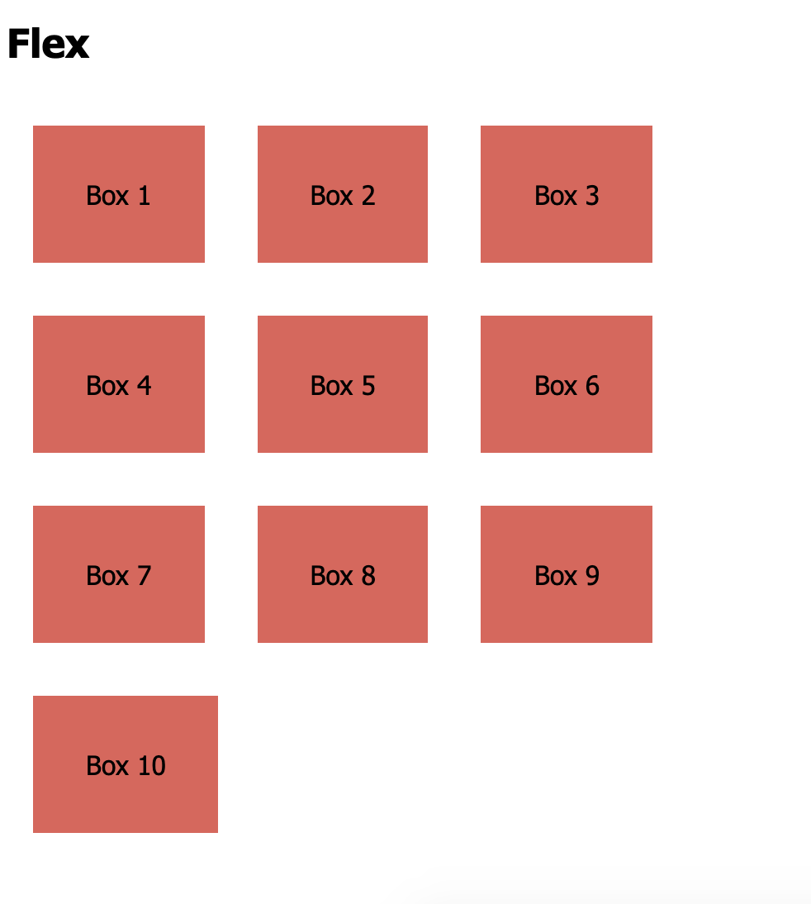
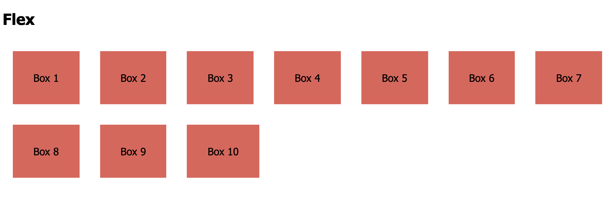

# Flex

When it comes to positioning elements in the real world we very often have to deal with dynamic content, think about websites being updated with users posting, deleting and updating elements. 

A very useful `display` property in this situation is `flex` (because it's flexible, get it?), also known as `CSS Flexbox`.

## Parent Child Relationship

Flex works by a parent controlling the positioning of it's children. The parent (flex container) controls how it's child elements (flex items) are arranged via various properties such as direction (row or column), automatically wrapping to a new row if they'd overflow and how the items are aligned in the rows.

This relationship is important and only works on **direct** children (nested children are unaffected so be careful if you're refactoring the html structure.)

## Useful flex properties

Some of the most useful flex properties that can be applied to the parent flex container are:

- [flex-direction](https://developer.mozilla.org/en-US/docs/Web/CSS/flex-direction): whether to arrange children in a row or column
- [flex-wrap](https://developer.mozilla.org/en-US/docs/Web/CSS/flex-wrap): whether children should be placed onto a new row if they would overflow
- [justify-content](https://developer.mozilla.org/en-US/docs/Web/CSS/justify-content): how the children are spaced out in a row horizontally. Default is as close to the start of the row as possible but can adjusted for even spacing
- [align-content](https://developer.mozilla.org/en-US/docs/Web/CSS/align-content): how the children are spaced out in a row vertically. Default is for them to be the same height as the row but can be adjusted to be centered or aligned to one end. (`flex-direction: column` and `align-items: center` is a nice way of keeping children in the center of the parent)

**nb** All of these properties require `display: flex` and will have no effect if the display is set to a different property

There are more properties than this and some that apply to the child flex items themselves. This is a [more comprehensive guide](https://css-tricks.com/snippets/css/a-guide-to-flexbox/) which explains them very well.

**Goal**:

- Apply flex to make the boxes align themselves left-to-right
- Boxes should continue on the next row once they reach the edge of the window

> Narrow Screen View
> 
> Wide Screen View
> 

**Extra Credit:** Let the boxes fill up that wasted space

> 

**More practice**
> [Flexbox Froggy](https://flexboxfroggy.com/) is a browser based game to get more familiar with the flex properties

